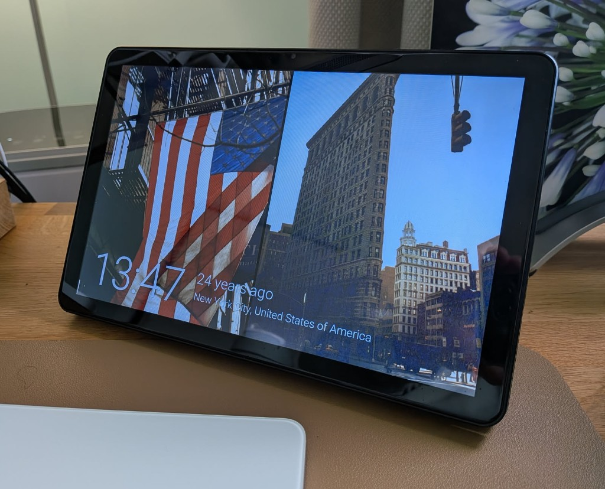

# Espframe for Immich

Turn a supported Guition ESP32-P4 touchscreen into a private digital photo frame for your [Immich](https://immich.app/) photo library.

Espframe is for people who want their photos out in the room, not hidden on a phone, and do not want to run another server, cloud account, or subscription just to make that happen. Flash the frame from a browser, connect it to WiFi, point it at Immich, and it starts showing your photos.

<p align="center">
  
</p>

## What Espframe Lets You Do

- **Make a real photo frame from your Immich library**  
  Show photos from the Immich server you already run, without needing a tablet, Raspberry Pi, Home Assistant, or a separate slideshow service.

- **Keep your photos private**  
  The frame connects directly to your Immich server over your own network. There is no Espframe cloud service and no extra account to trust with your pictures.

- **Choose what appears on the frame**  
  Combine albums, people, tags, favorites, ratings, dates, locations, exclusions, and orientation in one smart playlist.

- **Make portrait photos look better on a wide screen**  
  Espframe can pair portrait photos from a configurable nearby-day range side-by-side, so the display feels more like a composed frame and less like a single narrow image with empty space. You can also hide portraits when a complete pair is not available.

- **Tune the screen for your room**  
  Adjust brightness, warm up a panel that looks too blue, use a softer night tone after sunset, and schedule the display to turn off overnight.

- **Control it from the frame or a browser**  
  Use simple touch gestures to wake, sleep, or advance to the next photo, and swipe between image sets. Open the built-in web page on your phone or computer to change the photo filter, timing, brightness, Immich settings, and display options.

- **Use Home Assistant if you want to, but it is not required**  
  Espframe works by itself. If you already use Home Assistant, it can also appear there as an ESPHome device for dashboard controls, automations, and updates.

## Who This Is For

Espframe is a good fit if:

- You already use, or plan to use, Immich for your photo library.
- You want a dedicated photo frame instead of leaving a tablet permanently awake.
- You prefer local, self-hosted tools over cloud photo-frame services.
- You are comfortable following a step-by-step browser installer and copying an Immich API key.

It is not a general-purpose tablet app. It is firmware for specific ESP32-P4 touchscreen hardware.

## Hardware

Currently documented hardware:

| Item | Link |
|------|------|
| 10" Guition ESP32-P4 panel (`JC8012P4A1`), original (`2627` or lower) and new (`2628` or higher) revisions | [AliExpress](https://s.click.aliexpress.com/e/_c4LLo3rH) |
| 10" printable stand | [MakerWorld](https://makerworld.com/en/models/2490049-guition-p4-10inch-screen-stand#profileId-2736046) |

The two panel revisions look nearly identical but need different firmware. Choose the installer profile using the four-digit rear-case marking; the new panel may not be labelled `V2`.

## Getting Started

The easiest way to install Espframe is with the web installer. You do not need to install developer tools or build firmware yourself.

**[Open the Web Installer](https://jtenniswood.github.io/espframe/install)**

You will need:

- A supported Guition ESP32-P4 touchscreen
- A USB-C data cable, not a charge-only cable
- Chrome or Edge on a desktop computer
- Your Immich server address
- An Immich API key

The full setup guide is here:

**[jtenniswood.github.io/espframe](https://jtenniswood.github.io/espframe/)**

## Everyday Controls

Once installed, the frame has two main control surfaces:

- **On the touchscreen:** tap to wake, double-tap to advance to the next photo, swipe left for the next image set, swipe right for the previous image set, and press-and-hold to sleep.
- **In the web settings page:** change the smart photo filter, slideshow speed, brightness, screen tone, rotation, WiFi, Immich connection, and firmware update options.

## Development

Most people do not need this section. It is here for contributors or anyone who wants to build the docs or firmware locally.

```bash
# Docs site (live reload)
npm ci
npm run docs:dev

# Compile firmware locally
docker run --rm -v "${PWD}:/config" ghcr.io/esphome/esphome:2026.8.2 compile /config/builds/guition-esp32-p4-jc8012p4a1.factory.yaml
docker run --rm -v "${PWD}:/config" ghcr.io/esphome/esphome:2026.8.2 compile /config/builds/guition-esp32-p4-jc8012p4a1-v2.factory.yaml
docker run --rm -v "${PWD}:/config" ghcr.io/esphome/esphome:2026.8.2 compile /config/builds/guition-esp32-p4-jc8012p4a1-v3.factory.yaml
docker run --rm -v "${PWD}:/config" ghcr.io/esphome/esphome:2026.8.2 compile /config/builds/guition-esp32-p4-jc8012p4a1-v3-sd.factory.yaml
```

### In-Development Firmware Features

In-progress firmware experiences are built into normal firmware, but must stay off unless the hidden developer setting is enabled. Open the device web UI with `?developer=experimental`, for example `http://<device-ip>/?developer=experimental`, then use the **Developer** panel to turn them on for that device.

Firmware code should check `id(developer_features_enabled).state` before running anything experimental. The switch defaults off and persists only when deliberately enabled.

## License

Espframe's project-owned code and documentation are source-available under the [PolyForm Noncommercial License 1.0.0](LICENSE). You can use, change, and share it for non-commercial purposes. Commercial use needs separate permission from the project owner.

This is not an OSI-approved open source license because formal open source licenses must allow commercial use. Third-party components keep their own licenses.

## Support This Project

If you find this project useful, consider buying me a coffee to support ongoing development.

<a href="https://www.buymeacoffee.com/jtenniswood">
  
</a>
